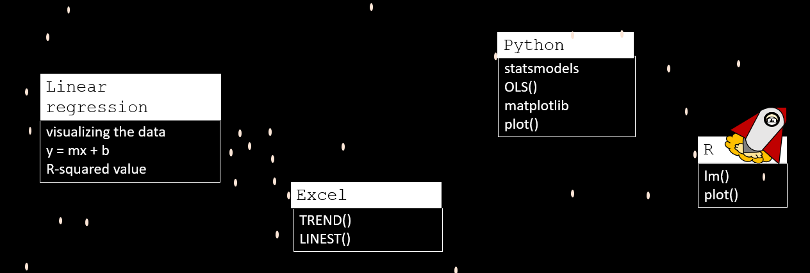
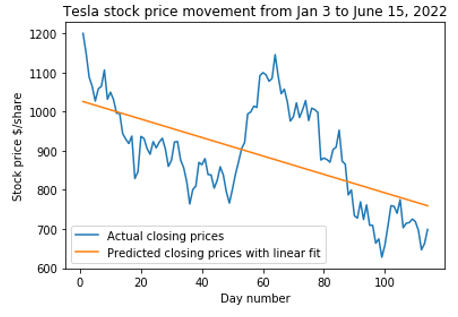
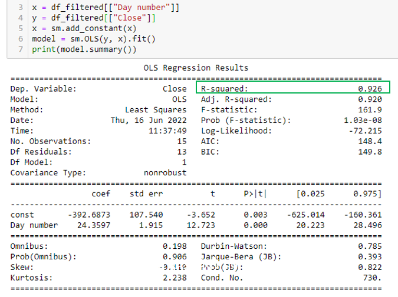
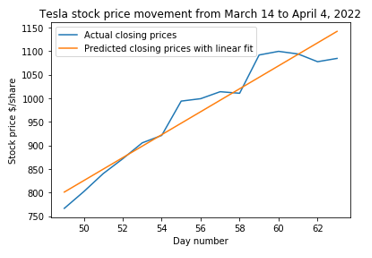

# LinearRegression_Python


[Hello, World!](https://www.youtube.com/watch?v=MrEkwt-wZ5w) I am the DataByte. This repo hosts my scripts (Python) that I walk through in my linear regression series on YouTube. 

Check out my video [Linear Regression with Excel, Python & R](https://www.youtube.com/watch?v=yWoRWu5FUZQ) to hear more about these topics:



# Mathematics

In my YouTube video, I give a short mathematical explanation of how linear regression trendlines are calculated with the least squares method. 

## R<sup>2</sup> value 

The r<sup>2</sup> value (the coefficient of determination) helps you determine if your data is exhibiting linear behavior or not. R<sup>2</sup> values range between 0 and 1, with 1 indicating a perfect linear trend. Values beteween 0.7 and 1 indicate that your data has a linear trend, the closer to 1, the better. You probably don't want to be using any linear trendlines with r<sup>2</sup> values less than 0.7 to make predictions. 

# Code

Linear regression in Python is easy using the `OLS()` function in the statsmodels library.  

```python
model = sm.OLS(y, x).fit()
```
Make sure you add a constant to your dataset with `x = sm.add_constant(x)` if you want the line of best fit to not just automatically assume that the y-intercept is equal to zero. If you want the point (x = 0, y = 0) to be included on your line of best fit, then you don't need to add this function. 

Calling `summary()` will give you a description of your model. 
 
Linear regression can help you capture the general trend of your data, but if the r<sup>2</sup> value is less than 0.7, it's not going to be very much good for making predictions.

 

Sometimes, you may be able to find a subset in your dataset that may still exhibit strongly linear characteristics, like Tesla stock's closing prices between March 14th and April 1st, 2022. It's an interesting observation, but if you told anyone you were trading off a linear model, they'd probably think you were crazy! 



 

# Dependencies

None

# References

It is easy to find sources online to learn more about linear regression, here are some great references to what I used. 

## Python:

[stasmodels.regression.linear_model.OLS](https://www.statsmodels.org/dev/generated/statsmodels.regression.linear_model.OLS.html)

[matplotlib.pyplot.plot](https://matplotlib.org/stable/api/_as_gen/matplotlib.pyplot.plot.html)

## Mathematical background: 

Miller, I., Freund, J. E., & Johnson, R. A. (2005). Miller and Freund's Probability and statistics for engineers. Upper Saddle River, NJ: Prentice Hall.

[Sigma summation](http://www.columbia.edu/itc/sipa/math/summation.html)

# More?

If you want to hear more from me, check out my [Hello, World!](https://www.youtube.com/watch?v=MrEkwt-wZ5w) video on YouTube and subscribe! I'm constantly working on new content :) 
